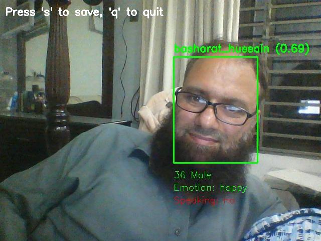

# Real-time Face Recognition with Audio Detection

A comprehensive real-time face recognition system that combines facial identification, emotion analysis, age/gender detection, and voice activity detection using InsightFace and DeepFace libraries.

# Employee Face Recognition System

 *Example of the system in action*

## Features

- **Real-time Face Recognition**: Identifies known faces from a pre-built database
- **Emotion Detection**: Analyzes facial expressions (happy, sad, angry, etc.)
- **Age & Gender Estimation**: Estimates age and determines gender with confidence thresholds
- **Voice Activity Detection**: Detects when a person is speaking using audio analysis
- **Frame Saving**: Save current frames with timestamp for documentation
- **Multi-face Support**: Handles multiple faces simultaneously in the frame

## Requirements

### Dependencies

```bash
pip install opencv-python
pip install insightface
pip install deepface
pip install pyaudio
pip install webrtcvad
pip install numpy
```

### System Requirements

- **Camera**: Webcam or USB camera
- **Microphone**: For voice activity detection
- **Python**: 3.7 or higher
- **Face Database**: Pre-existing `face_db.npy` file (see Setup section)

## Setup

### 1. Install Dependencies

```bash
# Install core packages
pip install opencv-python insightface deepface numpy

# Install audio packages
pip install pyaudio webrtcvad

# For Windows users, if pyaudio installation fails:
pip install pipwin
pipwin install pyaudio
```

### 2. Create Face Database

Before running the recognition system, you need a face database file (`face_db.npy`). This should contain embeddings of known faces:

```python
# Example structure of face_db.npy
face_db = {
    "John_Doe": numpy_embedding_array,
    "Jane_Smith": numpy_embedding_array,
    # ... more faces
}
```

**Note**: The system expects this file to exist. Run your face database creation script first.

### 3. Setup Directories

The system will automatically create these directories:
- `saved_frames/` - For saving captured frames

## Configuration

### Recognition Settings
```python
SIMILARITY_THRESHOLD = 0.6          # Face matching sensitivity (0.0-1.0)
MAX_DISTANCE = 1.0                  # Maximum distance for face matching
GENDER_CONFIDENCE_THRESHOLD = 0.75  # Minimum confidence for gender detection
```

### Audio Settings
```python
AUDIO_FRAME_DURATION = 30    # ms - Audio frame length
AUDIO_SAMPLE_RATE = 16000    # Hz - Audio sampling rate
AUDIO_SENSITIVITY = 1        # 1-3 (higher = more sensitive)
```

## Usage

### Basic Usage

```bash
python 02_realtime_rec_insight_deepface.py
```

### Controls

- **'s' Key**: Save current frame with timestamp
- **'q' Key**: Quit the application

### Display Information

For each detected face, the system shows:
- **Name**: If recognized, or "Unknown"
- **Confidence**: Recognition confidence score (0.0-1.0)
- **Age**: Estimated age
- **Gender**: Male/Female (only if confidence > 75%)
- **Emotion**: Dominant emotion (happy, sad, angry, etc.)
- **Speaking**: YES/no based on voice activity detection

## Output

### Console Output
```
✓ InsightFace model loaded
✓ Face database loaded with 5 profiles
✓ Audio system initialized
Frame saved as saved_frames/frame_20241201_143022_123456.jpg
```

### Visual Output
- Green bounding boxes: Recognized faces
- Red bounding boxes: Unknown faces
- Text overlays with face information
- Real-time video feed with mirror effect

## Architecture

### Core Components

1. **Face Detection**: InsightFace 'buffalo_l' model
2. **Face Recognition**: Cosine similarity matching
3. **Emotion Analysis**: DeepFace with multiple actions
4. **Voice Activity**: WebRTC VAD with PyAudio
5. **Video Processing**: OpenCV for camera and display

### Processing Flow

```
Camera Input → Face Detection → Face Recognition → Emotion Analysis
                                      ↓
Audio Input → Voice Activity Detection → Display Results
```

## Troubleshooting

### Common Issues

**Camera Not Working**
```bash
# Check camera permissions
# Close other applications using camera
# Try different camera index in cv2.VideoCapture(1)
```

**Audio Issues**
```bash
# Check microphone permissions
# Verify pyaudio installation
# Try different audio sensitivity settings
```

**Face Database Error**
```
Error: face_db.npy not found. Please run face_database.py first
```
Solution: Create the face database file before running recognition.

**Performance Issues**
- Reduce `det_size` in face_app.prepare() for faster processing
- Lower video resolution
- Reduce audio frame processing frequency

### Error Messages

| Error | Solution |
|-------|----------|
| `ModuleNotFoundError: No module named 'insightface'` | Install: `pip install insightface` |
| `Camera initialization failed` | Check camera permissions and availability |
| `Audio setup failed` | Install pyaudio: `pip install pyaudio` |
| `Analysis error` | Ensure face region is valid and visible |

## Performance Optimization

### Speed Improvements
- Use GPU providers for InsightFace: `providers=['CUDAExecutionProvider']`
- Reduce detection size: `det_size=(320, 320)`
- Skip emotion analysis for better performance

### Memory Usage
- Limit face database size
- Clear audio queue periodically
- Optimize frame processing frequency

## File Structure

```
project/
├── 02_realtime_rec_insight_deepface.py  # Main recognition script
├── face_db.npy                          # Face embeddings database
├── saved_frames/                        # Saved frame directory
│   └── frame_20241201_143022.jpg        # Saved frames
└── README.md                            # This file
```

## Technical Specifications

### Models Used
- **InsightFace**: buffalo_l model for face detection and embedding
- **DeepFace**: For emotion, age, and gender analysis
- **WebRTC VAD**: For voice activity detection

### Input/Output
- **Video Input**: 640x480 webcam feed
- **Audio Input**: 16kHz mono audio stream
- **Output**: Real-time annotated video with face information

## License

This project uses several open-source libraries:
- InsightFace (Apache 2.0)
- DeepFace (MIT)
- OpenCV (Apache 2.0)
- WebRTC VAD (BSD)

## Contributing

1. Fork the repository
2. Create a feature branch
3. Make your changes
4. Test thoroughly
5. Submit a pull request

## Support

For issues and questions:
1. Check the troubleshooting section
2. Verify all dependencies are installed
3. Ensure camera and microphone permissions
4. Create an issue with error details and system information