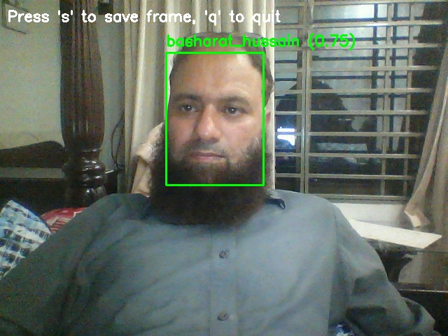

# Employee Face Recognition System using "InsightFace"

 

*Example of the system in action*

## Features

- 👥 **Multi-face recognition** from live video feed  
- 📁 **Structured employee database** with support for multiple images per person  
- 🖼️ **Resizable display window** with aspect ratio preservation  
- 📸 **Frame capture** with 's' key (saves to `saved_frames/`)  
- 📊 **Confidence scoring** for each recognition  
- ⚡ **Optimized performance** with InsightFace models  

## Folder Structure

```
employee_recognizer/
├── employee_photos/          # Employee image database
│   ├── Smith_John/           # Each employee has own folder
│   │   ├── photo1.jpg        # Multiple images per employee
│   │   └── photo2.jpg
│   └── Doe_Jane/
│       ├── photo1.jpg
│       └── photo2.jpg
├── saved_frames/             # Auto-created for saved screenshots
├── face_database.py          # Database creation script
└── realtime_rec.py           # Main recognition application
```

## Installation

1. **Clone the repository**
   ```bash
   git clone https://github.com/yourusername/employee-face-recognition.git
   cd employee-face-recognition
   ```

2. **Create virtual environment (recommended)**
   ```bash
   python -m venv .venv
   source .venv/bin/activate  # Linux/Mac
   .\.venv\Scriptsctivate   # Windows
   ```

3. **Install dependencies**
   ```bash
   pip install -r requirements.txt
   # or manually:
   pip install insightface opencv-python numpy
   ```

## Usage

### Prepare employee photos

- Create folders under `employee_photos/` for each employee  
- Add multiple clear frontal face images per employee  
- Name folders as `Lastname_Firstname`  

### Build face database
```bash
python face_database.py
```

### Run real-time recognition
```bash
python realtime_rec.py
```

## Controls

- `s` : Save current frame to `saved_frames/`  
- `q` : Quit application  
- Drag window edges : Resize display  

## Customization

### Configuration Options

Edit `realtime_rec.py` to adjust:

```python
SIMILARITY_THRESHOLD = 0.6  # Lower = more strict matching
MAX_DISTANCE = 1.0          # Maximum allowed distance
```

### For Better Accuracy

- Use 5–10 high-quality images per employee (500x500px minimum)  
- Include varied angles and expressions  
- Ensure good lighting in all photos  

## Troubleshooting

| Issue                    | Solution                              |
|--------------------------|----------------------------------------|
| "face_db.npy not found" | Run `face_database.py` first           |
| Poor recognition        | Add more employee photos, adjust threshold |
| CUDA errors             | Install CPU-only: `pip install onnxruntime` |
| OpenCV GUI issues       | Reinstall: `pip install opencv-python` |


### What InsightFace Provides Out-of-the-Box

| Feature               | Supported? | Notes                                  |
|-----------------------|------------|----------------------------------------|
| Face Detection        | ✅ Yes      | High accuracy with bounding boxes      |
| Face Recognition      | ✅ Yes      | State-of-the-art embeddings (ArcFace)  |
| Face Alignment        | ✅ Yes      | 2D/3D landmarks (68 or 106 points)     |
